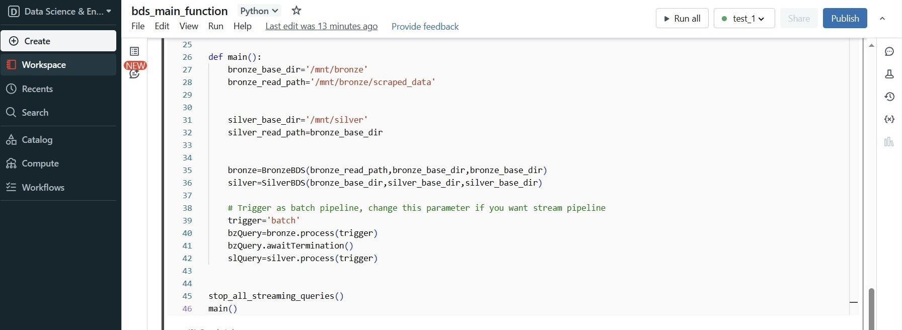

## Problem and Objective

During my research process for developing the Tokenized Real Estate Trading Exchange as part of my Blockchain university class, I stumbled upon an article titled ["Purchasing a house in Vietnam is an uphill battle - VnExpress International"](https://e.vnexpress.net/news/readers-views/purchasing-a-house-in-vietnam-is-an-uphill-battle-4547223.html) that highlighted the challenges associated with buying a house in Vietnam. According to the article:

> **"The average income of Vietnamese is just over $3,000 a year. Thus, it will take us more than <u>160 years-worth of income to purchase a house.</u>"**

As a "most rational Reddit user," I rarely believe in any newspaper unless it is backed by numbers. Therefore, I found it necessary to gather data and conduct my own analysis.

This project aims to build a web scraping pipeline to collect and analyze real estate data from [Batdongsan by PropertyGuru](https://batdongsan.com.vn/).

## Architecture

The pipeline crawls data from [Batdongsan by PropertyGuru](https://batdongsan.com.vn/) and consists of various modules and technologies:

- **Microsoft Azure**: Azure Functions (for crawling, extracting, and loading data), Azure Data Lake Storage Gen2 (for storing raw/transformed data)
- **Docker**: Containerizes the source code folder and deploys the image to Azure Functions for auto-scaling the crawler
- **Spark Structured Streaming**: A data processing framework that unifies both batch and streaming pipelines without rewriting code
- **Databricks**: A big data platform that allows running Spark Structured Streaming and using Delta Lake architecture without having to set up infrastructure manually
- **Power BI**: A BI tool to load data from Delta Tables using Power Query and create dashboards for analysis
- **Prefect**: An orchestration tool for managing the workflow

### Overview

- The [Batdongsan by PropertyGuru](https://batdongsan.com.vn/) multi-threaded crawler is implemented in Azure Functions and can be containerized to deploy as an image to Azure for auto-scaling.
- The extracted data from the crawler is directly stored in containers in ADLS.
- Databricks connects to ADLS and runs Spark Structured Streaming jobs to transform data.
- The entire data pipeline starts running when you trigger the HTTP endpoint of the `selenium_scrapping_batdongsan` Azure Function.

### ETL Flow

1. You trigger the HTTP endpoint of the `selenium_scrapping_batdongsan` Azure Function to start the pipeline. The crawler scrapes all properties' information on each page. Required parameters include:

   - **nthreads:** Sets the number of threads you want; each thread is a Selenium Chrome browser (e.g., if you set 3 threads, you will have 3 Selenium Chrome browsers scraping concurrently).
   - **num_pages:** Determines how many pages you want to scrape.
   - **limit_each_page:** Determines the number of properties you want to scrape on each page (maximum and default is 20).
   - **base_url_format:** Specifies a base URL of the [Batdongsan](https://batdongsan.com.vn/) website you want to crawl (e.g., https://batdongsan.com.vn/ban-nha-rieng-tp-hcm).

2. Raw data is saved as a JSON file and uploaded to a `Bronze` container in ADLS.
   

3. After the scraping process finishes, the `bds_main_function` notebook in Databricks ingests data from the bronze container and creates a **Bronze Delta Table**. Raw data is then transformed, deduplicated, and loaded into a **Silver Delta Table** in a `Silver` container.

4. Finally, use Power Query in Power BI to directly load data from the Silver Delta Table and create a dashboard.
   

### Data Modeling and Power BI Dashboard

- **Data Modeling**: The data model is structured to support efficient querying and analysis within Power BI.
  

- **Power BI Dashboard**: The dashboard visualizes key metrics and trends in the real estate market.
  

## How to Run

### Set up the Crawler

Install the following modules:

- **Docker Desktop and Docker Engine**: For running containers
- **Azure Core Function Tool**
- **VS Code and Extensions**: For local debugging and testing: Azure Account, Azure Function, Azure Resources
- **Postman**: For sending API requests
- All libraries listed in `src/batdongsan_function_app/requirement.txt`

#### Create Azure Resources

Create the following resources to prepare for the data pipeline:

- 1 ADLS Gen2 and 2 containers for the data layer: bronze, silver
  

#### Set up ADLS Credentials

- Create `config.json` in `src/batdongsan_function_app` and include your credentials to access Azure resources.
- If you want to upload raw data to ADLS containers, remember to set up credentials like ADLS storage's name, connection string, and key. Otherwise, scraped data will be saved to the local folder `scraped_data`.
  

- **Azure Functions Overview**: Every Azure Function folder will have the structure shown below:
  - `__init__.py` contains the main code to execute
  - `function.json` contains the function's settings, including **binding**/**trigger**
    

#### Test and Debug the Data Pipeline

- Navigate to the `src/batdongsan_function_app` path inside the Git repo. Open the folder using VS Code, install all libraries listed in `requirement.txt`, press F5, and use Postman to test the crawler.
  

- Alternatively, run `docker compose up --build`. Go to Postman, paste the URL provided below, and pass the required parameters:
  > http://localhost:9090/api/selenium_scrapping_batdongsan

#### Deploy the Crawler in Azure Functions

- After debugging and testing, use `docker build` and `docker push` to create and push the image to Docker Hub or Azure ACR. Remember to remove or comment out all `.write()` commands, as deployed Azure Functions will restart if any changes are made to the source folder at runtime.
- Go to the Azure Portal and deploy your crawler as an image in the Azure Functions App. You can now use the URL to call the crawler.
  

- It took approximately 30 minutes to crawl 50 pages using an EP3 SKU instance, which costs around $0.9/hour.
  

### Set up Databricks

Upload 3 Python notebooks in the `src/databrick_notebook` path to your Databricks workspace:

- `bds_streaming_pipeline`: Includes Bronze and Silver classes for the data pipeline.
- `bds_test_suite`: For debugging and testing purposes.
- `bds_main_function`: Serves as the entry point to connect/mount to ADLS and run the data pipeline.
  
